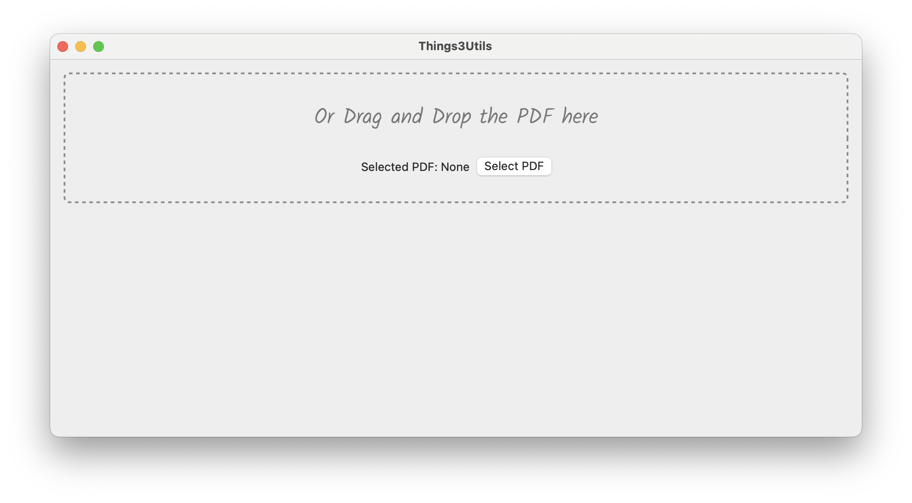
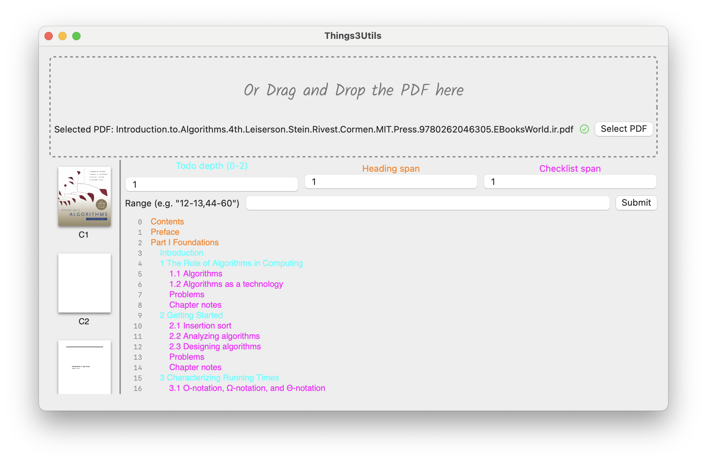
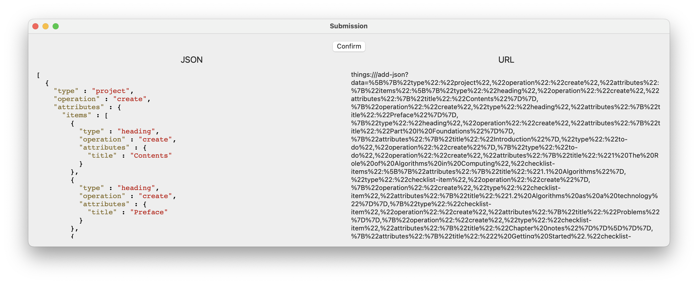
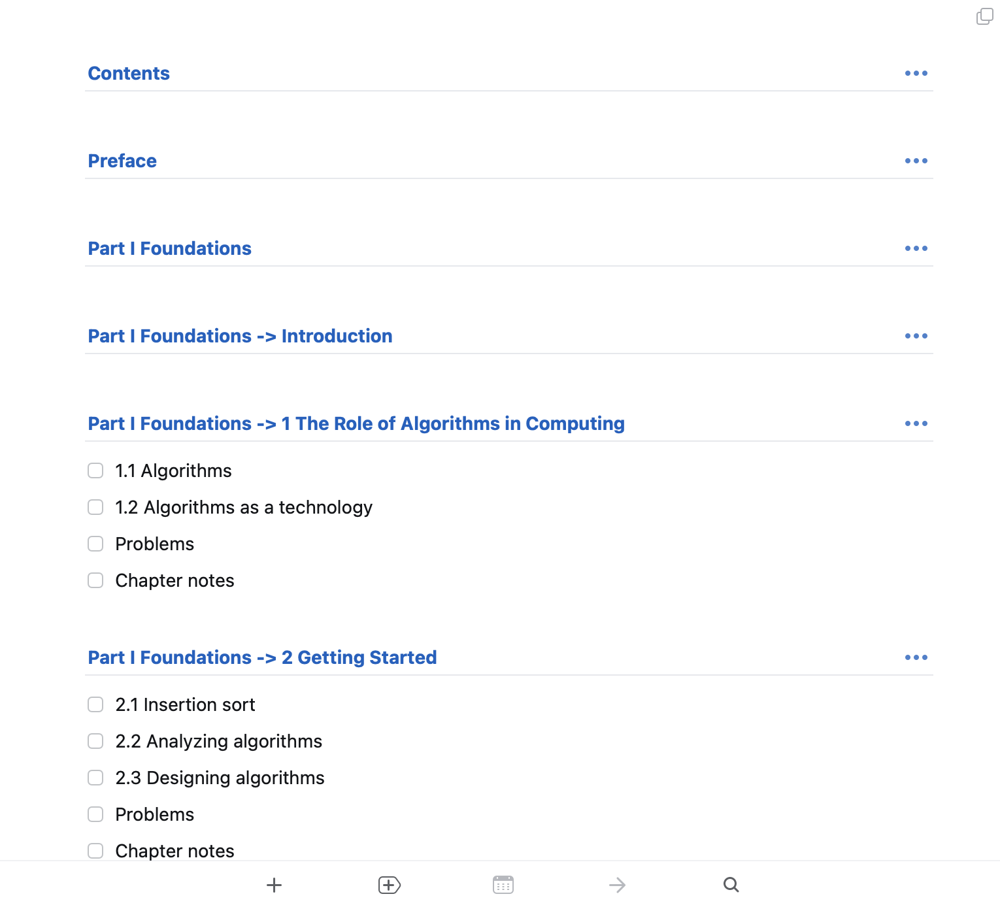

# About
Export PDF outline to Things 3 todo list so that you can track your reading progress.
# Features
- [x] Discrete page selection: 2-34, 66-21... whatever strange combinations you may want
- [x] Concatenate todo titles: You can now combine two levels of outline into one todo, separated by ->
- [x] Performance improvement: Refactored to use CoreText, running super fast

# Notes
After selecting your pdf file that has an outline, first input the "Todo depth", which is a single number of a range. The highlighted outlines will become Things 3's main todo entry.
"Heading span" sets the number of parent outlines that will become the main todo entry's heading.
Similarly, "Checklist span" sets the number of child outlines that will become a main todo entry's checklist.

They are highlighted correspondingly, feel free to explore different settings if you do not get this at first.
# Screenshots
First select or drag and drop your pdf:

Then tweak your settings:

Confirm:

The resulting Things 3 todo list with optional headings and checklist:

